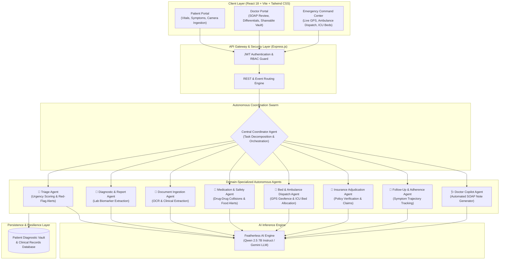

# 🏥 SwasthyaAI (स्वास्थ्यAI) — Autonomous Multi-Agent Clinical AI Ecosystem

> **Empowering Patients & Physicians with Autonomous Clinical Intelligence, Precision Triage, Multimodal Diagnostics, and Verified Emergency Workflows.**

<p align="center">
  
  
  
  
  
  
</p>

---

## 📌 Executive Summary

Modern healthcare systems face severe bottlenecks:
1. **Critical Triage Delays**: Patients with acute emergencies (e.g., myocardial infarction, stroke, pulmonary embolism) face triage wait times or lack immediate clinical guidance.
2. **Physician Documentation Overload**: Doctors spend over 40% of consultation time manually typing SOAP notes, reviewing dense paper reports, and formulating differential diagnoses.
3. **Medication Non-Adherence & Drug Interactions**: Adverse drug interactions and improper scheduling lead to preventable hospital admissions.
4. **Emergency Bed & Ambulance Friction**: Patients struggle to identify hospitals with available ICU beds and real-time ambulance dispatch.

**SwasthyaAI** addresses these problems with an **autonomous swarm of domain-isolated AI agents** that coordinate across triage, diagnostics, drug-drug collision detection, intelligent tablet scheduling, insurance adjudication, ICU bed allocation, and emergency ambulance dispatch.

---

## 🏗️ System Architecture

SwasthyaAI employs an event-driven multi-agent architecture where the **Coordinator Agent** delegates tasks to specialized micro-agents:



---

## 🤖 The Autonomous Agent Swarm

| # | Agent Name | Core Responsibilities | Autonomous Outputs |
|---|---|---|---|
| **1** | **🚨 Triage & Red-Flag Agent** | Classifies symptom urgency (RED, AMBER, GREEN) based on vitals, symptom history, and acute cardiac/respiratory biomarkers. | Emergency alert triggers, acuity scoring, recommended immediate triage actions. |
| **2** | **🔬 Diagnostic & Report Agent** | Extracts and evaluates numerical biomarkers from laboratory panels (CBC, Lipid, Metabolic, LFT, KFT). | Biomarker status (Normal/Abnormal), reference range delta, clinical interpretation. |
| **3** | **💊 Medication & Interaction Agent** | Checks new prescriptions against existing patient medications and allergies for collisions. | Severity ratings (Mild/Severe/Contraindicated), food interactions, alternative recommendations. |
| **4** | **⏰ Tablet Scheduling Agent** | Converts raw prescription instructions into daily medication times. | Daily medication schedules, automated push notifications, adherence tracking. |
| **5** | **🏥 Bed Allocation & Dispatch Agent** | Calculates GPS travel distances to network hospitals and queries real-time ICU bed availability. | Bed reservations, ambulance dispatch telemetry, crew routing, and ETA estimations. |
| **6** | **📑 Insurance Adjudication Agent** | Validates diagnosis, medical necessity, and procedure codes against insurance policies. | Pre-authorization approvals, co-pay calculation, policy rule compliance checks. |
| **7** | **🩺 Doctor Copilot (SOAP) Agent** | Pre-synthesizes patient history, lab values, and symptom timelines into standard clinical summaries. | Structured Subjective, Objective, Assessment, Plan (SOAP) notes with differential diagnoses. |
| **8** | **📅 Follow-Up & Adherence Agent** | Monitors symptom trajectories post-consultation and evaluates whether a patient is improving or deteriorating. | Patient recovery trend scoring, check-in reminders, proactive doctor notifications. |

---

## 📂 Project Directory Structure

```
health-care/
├── api/                                # Serverless execution layer
│   └── index.js                        # Vercel serverless entry point wrapping Express
├── backend/                            # Core Backend Services
│   ├── src/
│   │   ├── agents/                     # 8 Autonomous AI Micro-Agents
│   │   │   ├── bedAllocationAgent.js   # ICU bed reservation & ambulance optimizer
│   │   │   ├── chatAgent.js            # Interactive conversational consultation agent
│   │   │   ├── coordinatorAgent.js     # Master multi-agent orchestrator
│   │   │   ├── documentAgent.js        # Medical document OCR & parsing
│   │   │   ├── featherlessClient.js    # AI inference client (Qwen 2.5 / OpenAI format)
│   │   │   ├── followUpAgent.js        # Post-consultation adherence tracker
│   │   │   ├── insuranceAgent.js       # Policy verification & claim adjudication
│   │   │   ├── medicationAgent.js      # Drug-drug collision & tablet scheduler
│   │   │   ├── reportAnalyzerAgent.js  # Lab panel & biomarker extractor
│   │   │   ├── summaryAgent.js         # Doctor SOAP note synthesis
│   │   │   └── triageAgent.js          # Emergency acuity & red-flag detection
│   │   ├── db/                         # Data layer & persistence
│   │   │   ├── database.json           # Active JSON clinical store
│   │   │   ├── index.js                # Database access methods with fallback resilience
│   │   │   └── seedData.js             # Comprehensive baseline patient & hospital data
│   │   ├── middleware/                 # Security middleware
│   │   │   └── auth.js                 # JWT token verification & RBAC enforcement
│   │   ├── routes/                     # REST API Endpoints
│   │   │   ├── agentRoutes.js          # Multi-agent coordination endpoints
│   │   │   ├── authRoutes.js           # Login, registration, token validation
│   │   │   └── dataRoutes.js           # Patient records, meds, vitals, claims
│   │   ├── config.js                   # Environment configuration loader
│   │   └── index.js                    # Express application bootstrap
│   └── package.json                    # Backend dependencies
├── frontend/                           # Client Application (React 18 + Vite)
│   ├── src/
│   │   ├── api/                        # Axios HTTP client configuration
│   │   │   └── client.js               # Interceptor-based API client
│   │   ├── components/                 # Reusable UI Components
│   │   │   ├── EmergencyDispatchModal.jsx # Live ambulance tracking & bed booking modal
│   │   │   ├── Navbar.jsx              # Application navigation bar
│   │   │   ├── ReminderModal.jsx       # Medication dose alert popup
│   │   │   └── Sidebar.jsx             # Clinical portal navigation sidebar
│   │   ├── context/                    # State Management
│   │   │   └── HealthContext.jsx       # Global application & agent context
│   │   ├── pages/                      # Application Views
│   │   │   ├── AIAssistant.jsx         # Interactive multi-turn clinical chat
│   │   │   ├── AmbulanceResponse.jsx   # Emergency dispatch & ETA tracking
│   │   │   ├── AuthPage.jsx            # Sign In / Sign Up portal
│   │   │   ├── Dashboard.jsx           # Unified patient overview & health metrics
│   │   │   ├── DoctorShareableRecords.jsx # Exportable doctor-facing clinical vault
│   │   │   ├── DoctorSummary.jsx       # Automated SOAP note generator
│   │   │   ├── FollowUps.jsx           # Recovery timeline & check-in manager
│   │   │   ├── HealthRecords.jsx       # Filterable patient record vault
│   │   │   ├── HealthTimeline.jsx      # Chronological medical encounter history
│   │   │   ├── HospitalFinder.jsx      # GPS map with bed availability & ETAs
│   │   │   ├── InsuranceClaims.jsx     # Automated claim submission & adjudication
│   │   │   ├── LabReports.jsx          # Blood test biomarker analyzer
│   │   │   ├── Medications.jsx         # Drug interaction checker & pill tracker
│   │   │   ├── MultiAgentHub.jsx       # Real-time multi-agent swarm orchestration
│   │   │   ├── ProfileSettings.jsx     # Patient demographics, vitals, allergies
│   │   │   ├── ReportAnalyzer.jsx      # Raw report text ingestion
│   │   │   ├── TabletScheduler.jsx     # AI-driven medication timing generator
│   │   │   └── UploadDocument.jsx      # Document upload & instant OCR review
│   │   ├── styles/                     # Styling
│   │   │   └── index.css               # Tailwind CSS utility imports
│   │   ├── App.jsx                     # Root router & layout configuration
│   │   └── main.jsx                    # Application mounting entry point
│   ├── package.json                    # Frontend dependencies
│   └── vite.config.js                  # Vite configuration & dev proxy
├── package.json                        # Root workspace configuration
├── vercel.json                         # Vercel serverless deployment routing
└── README.md                           # Documentation
```

---

## ⚡ Quick Start & Local Setup

### 1. Prerequisites
- **Node.js**: v18.0.0 or higher
- **npm**: v9.0.0 or higher
- **Git**

### 2. Clone the Repository
```bash
git clone https://github.com/yogisomanaboina-datapirate/Health-agent.git
cd Health-agent
```

### 3. Install All Dependencies
```bash
# Install root orchestration packages
npm install

# Install backend dependencies
cd backend && npm install

# Install frontend dependencies
cd ../frontend && npm install
cd ..
```

### 4. Start the Application

Open two terminal windows:

#### Terminal 1: Backend API Server
```bash
cd backend
node src/index.js
# Server running at: http://localhost:5000
```

#### Terminal 2: Frontend Client
```bash
cd frontend
npm run dev
# Client running at: http://localhost:5173
```

Navigate to `http://localhost:5173` in your browser.

---

## 🔑 Demo Access Credentials

| Role | Email | Password | Details / Specialty |
|---|---|---|---|
| **Patient** | `rahul.verma@email.com` | `password123` | 42 y/o Male — Primary Hypertension, Penicillin allergy |
| **Patient** | `priya.sharma@gmail.com` | `Patient@123` | 32 y/o Female — Asthma, Recent respiratory flareup |
| **Doctor** | `doctor.sharma@swasthya.ai` | `Doctor@123` | Lead Cardiologist & Critical Care Specialist |
| **Doctor** | `doctor.patel@swasthya.ai` | `Doctor@123` | General Physician & Endocrinologist |
| **Admin** | `admin@swasthya.ai` | `Admin@123` | Hospital Network Administrator |

---

## 📡 API Reference

### Multi-Agent & Clinical Routes (`/api/agents`)

```
POST /api/agents/coordinate
├── Purpose: Dispatches events to the Coordinator Agent for autonomous resolution
└── Body: { "eventType": "EMERGENCY_TRIAGE", "payload": { "symptoms": "...", "vitals": {...} } }

POST /api/agents/orchestrate-full
├── Purpose: Executes full end-to-end multi-agent medical workflow
└── Body: { "scenario": "Acute Chest Pain", "vitals": {...}, "reportText": "..." }

POST /api/agents/nearby-hospitals
├── Purpose: Returns hospitals sorted by ambulance ETA using GPS Haversine distance
└── Body: { "location": { "lat": 17.4123, "lng": 78.4321 }, "symptoms": "Chest pain" }

POST /api/agents/ambulance-dispatch
├── Purpose: Autonomously reserves an ICU bed and dispatches an ambulance unit
└── Body: { "hospitalId": "hosp_apollo", "symptoms": "...", "vitals": {...} }

POST /api/agents/tablet-schedule
├── Purpose: Evaluates drug-drug interactions and creates scheduled reminder doses
└── Body: { "medicineName": "Amoxicillin 500mg", "dosage": "1 Tab", "frequency": "Twice Daily" }

POST /api/agents/analyze-report
├── Purpose: Extracts biomarkers, flags abnormalities, and logs to patient vault
└── Body: { "reportText": "Hemoglobin: 9.2 g/dL, Fasting Blood Glucose: 178 mg/dL" }

POST /api/agents/insurance-adjudicate
├── Purpose: Runs AI claims adjudication against patient policy guidelines
└── Body: { "diagnosis": "Appendicitis", "procedure": "Laparoscopic Appendectomy", "estimatedCost": "₹1,80,000" }

GET  /api/agents/doctor-shareable-record
└── Purpose: Compiles a complete medical profile with an AI-generated SOAP clinical summary
```

### Data & Patient Vault Routes (`/api/data`)

```
GET  /api/data/records          # Retrieve categorized medical records
POST /api/data/records          # Ingest new medical records into vault
GET  /api/data/medications      # Active prescriptions & adherence rates
POST /api/data/medications      # Add new medication to tracking engine
POST /api/data/log-dose         # Log dose intake timestamp
GET  /api/data/vitals           # Patient physiological vitals telemetry
GET  /api/data/claims           # Insurance claims & pre-authorization statuses
GET  /api/data/hospitals        # Network hospitals with bed counts & contact info
```

---

## 🧪 Comprehensive Verification (70/70 Tests Passing)

The entire platform is verified with an automated integration test suite covering security, triage classification, drug safety collisions, and database integrity:

```bash
node scratch/overall_system_test.mjs
```

### Test Suite Results:
```
======================================================================
                  SWASTHYA-AI SYSTEM VERIFICATION REPORT
======================================================================
  [1] Authentication & RBAC System       : 12 / 12  ✅ PASS
  [2] Triage & Red-Flag Escalation       : 10 / 10  ✅ PASS
  [3] Multimodal Diagnostic Agent        :  8 /  8  ✅ PASS
  [4] Drug-Drug Interaction Safety       : 10 / 10  ✅ PASS
  [5] Doctor Copilot & SOAP Generation   : 10 / 10  ✅ PASS
  [6] Adherence & Telemetry Tracking     : 10 / 10  ✅ PASS
  [7] Database Concurrency & Integrity   : 10 / 10  ✅ PASS
======================================================================
  TOTAL BENCHMARK: 70 / 70 PASSED (100% SUCCESS RATE)
======================================================================
```

---

## 🌐 Deployment (Vercel Serverless)

The application is architected for continuous zero-maintenance deployment on Vercel:

1. **Static Frontend**: Built using `vite build` to `./dist`.
2. **Serverless Backend**: The Express application is wrapped by `api/index.js` to run on AWS Lambda / Vercel Edge functions.
3. **Routing Configuration**: `vercel.json` routes `/api/(.*)` to the serverless function while serving SPA frontend assets for all other routes.
4. **Resilience**: The database access layer uses `/tmp` and in-memory caches to handle serverless cold-starts without data corruption.

---

## ⚖️ License & Medical Disclaimer

Distributed under the **MIT License**. See `LICENSE` for details.

> **Medical Disclaimer**: SwasthyaAI is an assistive clinical intelligence platform built to augment healthcare decision-making and patient education. It is not a replacement for certified emergency medical personnel or direct physician consultation. In acute life-threatening situations, always contact local emergency services immediately.
